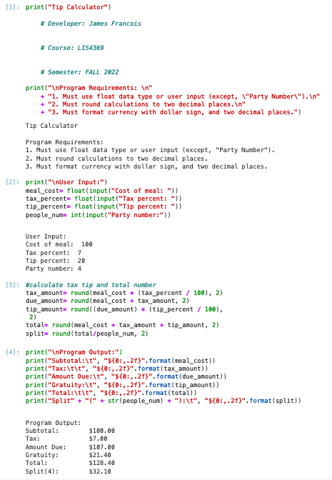

> **NOTE:** This README.md file should be placed at the **root of each of your repos directories.**
>
>Also, this file **must** use Markdown syntax, and provide project documentation as per below--otherwise, points **will** be deducted.
>

# LIS 4369

## James Francois

### Assignment 1 Requirements:

*Sub-Heading:*

1. Git commands w/short descriptions
2. Screenshot of a1_tip_calculator running in Visual Studio Code
3. Screenshot of a1_tip_calculator running in Juypter Lab 
4. Screenshot of a1_tip_calculator running in IDLE

#### README.md file should include the following items:
* Git commands w/short descriptions
* Screenshot of a1_tip_calculator running in Visual Studio Code
* Screenshot of a1_tip_calculator running in Juypter Lab 
* Screenshot of a1_tip_calculator running in IDLE

> This is a blockquote.
> 
> This is the second paragraph in the blockquote.
>
> #### Git commands w/short descriptions:

1. git init - creates a new git repositroy.
2. git status - displays the state of the working directory and the staging area
3. git add - adds a change in the working directory to the staging area.
4. git commit - captures a snapshot of the project's currently staged changes.
5. git push - upload local repository content to a remote repository.
6. git pull - fetch and download content from a remote repository and immediately update the local repository to match that content.
7. git config - a convenience function that is used to set Git configuration values on a global or local project level. 

#### Assignment Screenshots:

| Screenshot of a1_tip_calculator running in Visual Studio Code |
| -------------- |
|  |

| Screenshot of a1_tip_calculator running in Juypter Lab |
| -------------- |
|  |

| Screenshot of a1_tip_calculator running in IDLE |
| -------------- |
|  |

#### Assignment Link:
*Link to A1.ipynb File:*
[A1.ipynb Link](a1.ipynb)

#### Tutorial Links:

*Bitbucket Tutorial - Station Locations:*
[A1 Bitbucket Station Locations Tutorial Link](https://bitbucket.org/username/bitbucketstationlocations/ "Bitbucket Station Locations")

*Tutorial: Request to update a teammate's repository:*
[A1 My Team Quotes Tutorial Link](https://bitbucket.org/username/myteamquotes/ "My Team Quotes Tutorial")