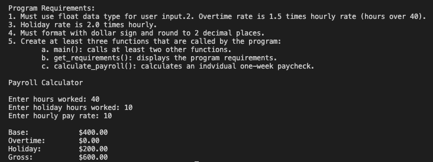
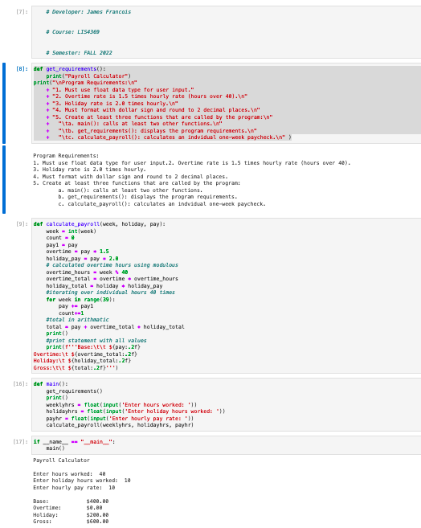
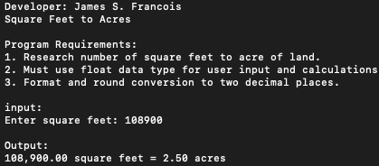
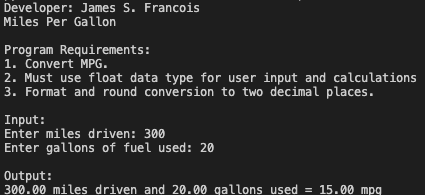
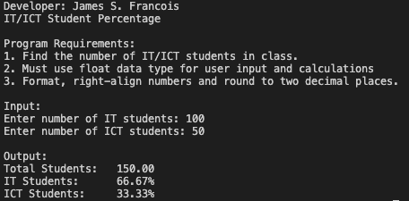

> **NOTE:** This README.md file should be placed at the **root of each of your main directory.**

# LIS 4381 

## James Francois

### Assignment 2 Requirements:

*Sub-Heading:*

1. Screenshot of Payroll with no Overtime
2. Screenshot of Payroll with Overtime
3. Screenshot of payroll running in Juypter Lab
4. Skillsets

#### README.md file should include the following items:

* Screenshot of Payroll with no Overtime
* Screenshot of Payroll with Overtime
* Screenshot of payroll running in Juypter Lab
* Skillsets

#### Assignment Screenshots:

| Screenshot of Payroll with no Overtime | Screenshot of Payroll with Overtime |
| -------------- | -------------- |
|  |  |

| Screenshot of payroll running in Juypter Lab | Screenshot of Skillset 1 |
| -------------- | -------------- |
|  |  |

| Screenshot of Skillset 2 | Screenshot of Skillset 3 |
| -------------- | -------------- |
|  |  |

#### Assignment Link:
*Link to A2.ipynb File:*
[A2.ipynb](a2.ipynb)

#### Tutorial Links:

*Bitbucket Tutorial - Station Locations:*
[A1 Bitbucket Station Locations Tutorial Link](https://bitbucket.org/username/bitbucketstationlocations/ "Bitbucket Station Locations")

*Tutorial: Request to update a teammate's repository:*
[A1 My Team Quotes Tutorial Link](https://bitbucket.org/username/myteamquotes/ "My Team Quotes Tutorial")