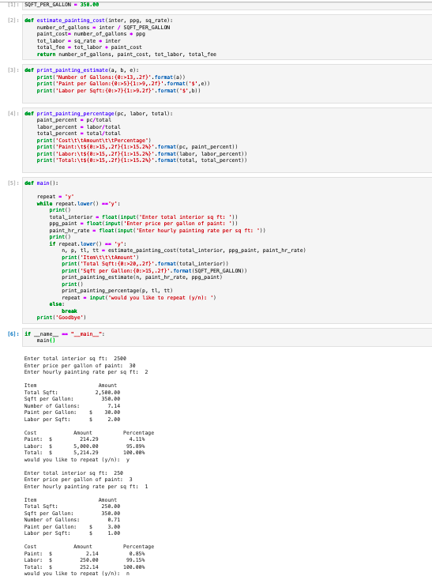
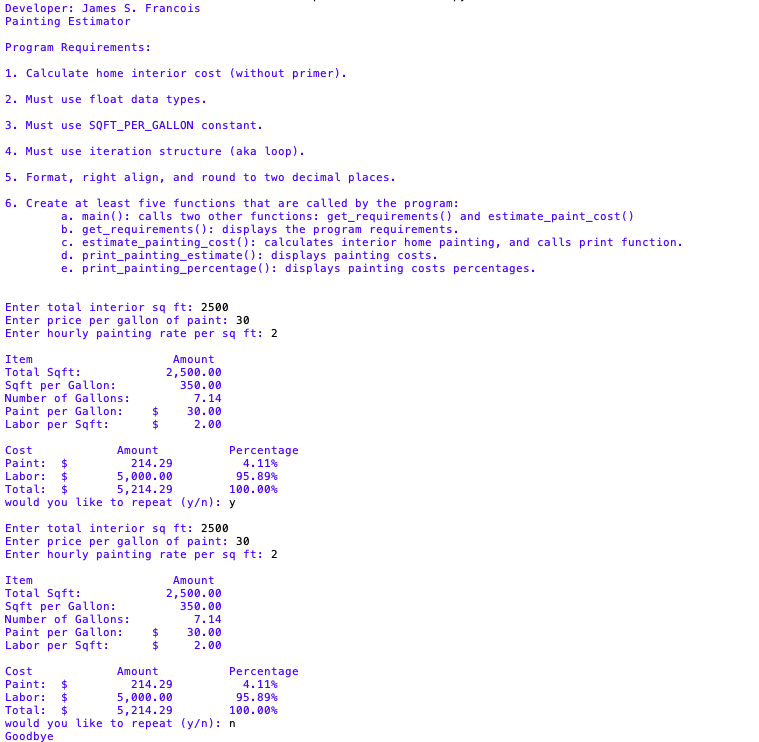

> **NOTE:** This README.md file should be placed at the **root of each of your main directory.**

# LIS 4369

## James Francois

### Assignment 3 Requirements:

1. Assignment requirements, as per A1. 
2. Screenshot as per example below, and include Jupyter Notebook screenshot. 
3. Upload A3 .ipynb file and create link in README.md;  
4. Screenshots of Skillsets 4-6

#### README.md file should include the following items:

* Assignment requirements, as per A1. 
* Screenshot as per example below, and include Jupyter Notebook screenshot. 
* Upload A3 .ipynb file and create link in README.md;  
* Screenshots of Skillsets 4-6

#### Assignment Screenshots:

| Screenshot of Painting Estimator in Juypter Labs | Screenshot of Painting Estimator in IDLE |
| -------------- | -------------- |
|  |  |

| Screenshot of Skillset 4 | Screenshot of Skillset 5 |
| -------------- | -------------- |
|  |  |

| Screenshot of Skillset 6 |
| -------------- | 
|  |

*Link to A3.ipynb File:*
[A3.ipynb](a3.ipynb)

#### Tutorial Links:

*Bitbucket Tutorial - Station Locations:*
[A1 Bitbucket Station Locations Tutorial Link](https://bitbucket.org/username/bitbucketstationlocations/ "Bitbucket Station Locations")

*Tutorial: Request to update a teammate's repository:*
[A1 My Team Quotes Tutorial Link](https://bitbucket.org/username/myteamquotes/ "My Team Quotes Tutorial")