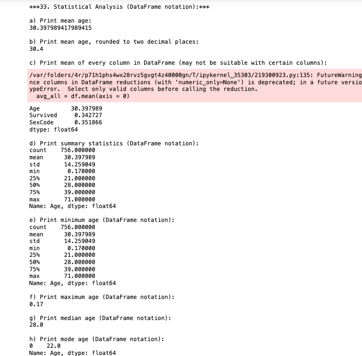

# LIS 4369 

## James Francois

### Assignment 4 Requirements:

*Sub-Heading:*

1. Assignment requirements, as per A1. 
2. Screenshot as per example below, and include Jupyter Notebook screenshot. 
3. Upload A4.ipynb file and create link in README.md;  
4. Screenshots of Skillsets 10-12

#### README.md file should include the following items:

* Assignment requirements, as per A1. 
* Screenshot as per example below, and include Jupyter Notebook screenshot. 
* Upload A4.ipynb file and create link in README.md;  
* Screenshots of Skillsets 10-12

#### Assignment Screenshots:

| Screenshot of Visual Studio Code | Screenshot of Skillset 10 |
| -------------- | -------------- |
|  |  |

| Screenshot of Skillset 11| Screenshot of Skillset 12 |
| -------------- | -------------- |
|  |  |

| Screenshot of Juypter Labs 1| Screenshot of Juypter Labs 2|
| -------------- | -------------- |
|  |  |

| Screenshot of Juypter Labs 3| Screenshot of Juypter Labs 4 |
| -------------- | -------------- |
|  |  |

| Screenshot of Juypter Labs 5| Screenshot of Juypter Labs 6|
| -------------- | -------------- |
|  |  |

| Screenshot of Juypter Labs 7| Screenshot of Juypter Labs 8 |
| -------------- | -------------- |
|  |  |

| Screenshot of Juypter Labs 9| Screenshot of Juypter Labs 10|
| -------------- | -------------- |
|  |  |

| Screenshot of Juypter Labs 11| Screenshot of Juypter Labs 12 |
| -------------- | -------------- |
|  |  |

| Screenshot of Juypter Labs 13| Screenshot of Juypter Labs 14|
| -------------- | -------------- |
|  |  |

| Screenshot of Juypter Labs 15| Screenshot of Juypter Labs 16 |
| -------------- | -------------- |
|  |  |

| Screenshot of Juypter Labs 17| 
| -------------- | 
|  |

*Link to A4.ipynb File:*
[A4.ipynb](a4.ipynb)

#### Tutorial Links:

*Bitbucket Tutorial - Station Locations:*
[A1 Bitbucket Station Locations Tutorial Link](https://bitbucket.org/username/bitbucketstationlocations/ "Bitbucket Station Locations")

*Tutorial: Request to update a teammate's repository:*
[A1 My Team Quotes Tutorial Link](https://bitbucket.org/username/myteamquotes/ "My Team Quotes Tutorial")