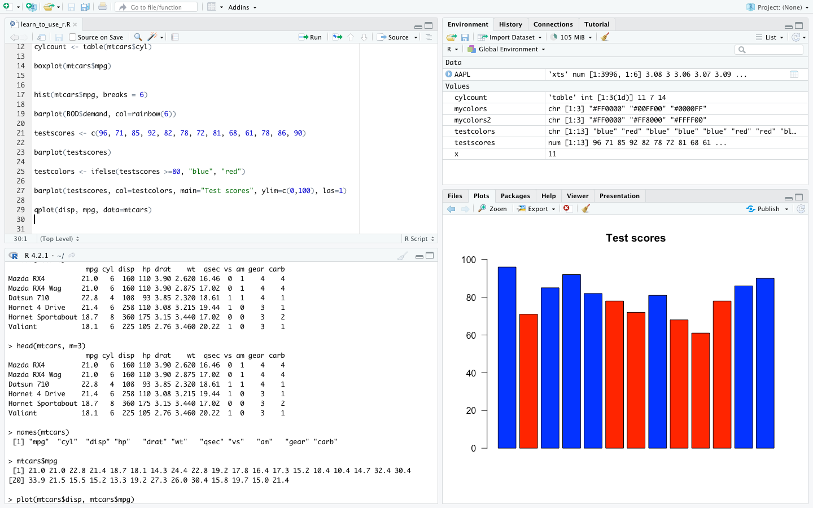
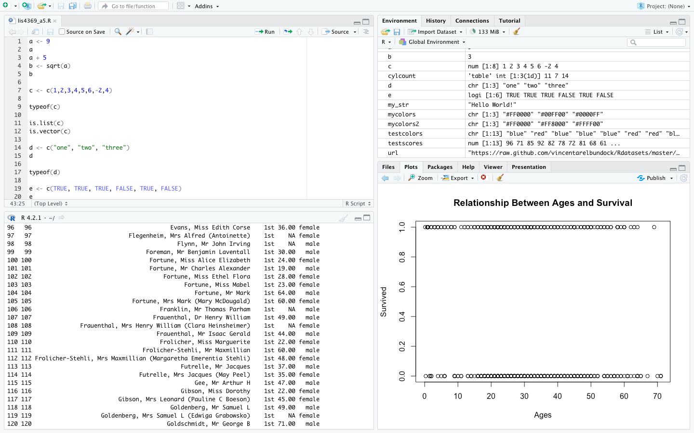
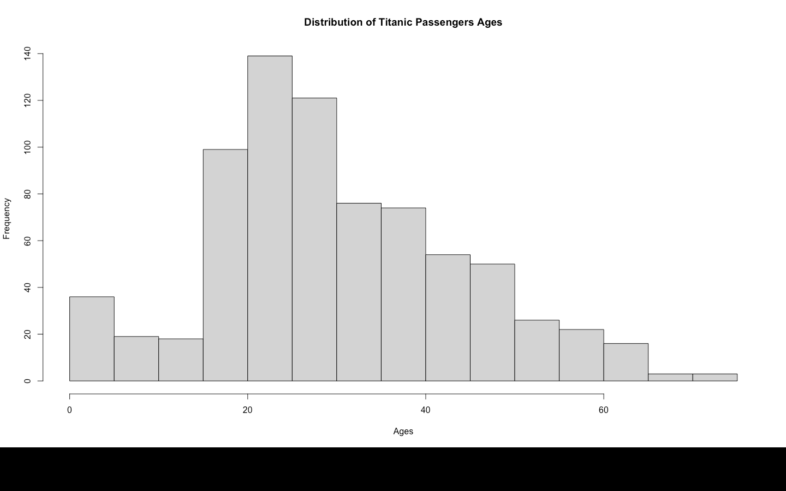
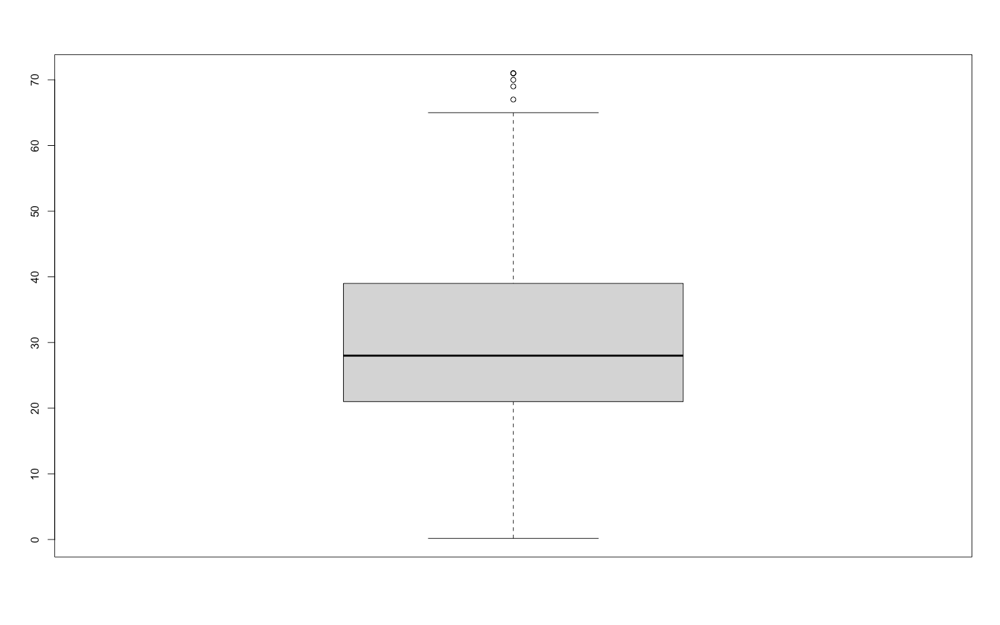

# LIS 4369 

## James Francois

### Assignment 5 Requirements:

*Sub-Heading:*

1. Complete tutourial Intro_to_R_setup
2. Code and run lis4369_a5.r
3. Include at least two 4-panel R Studio screenshots
4. Include links for both in a5 README.md
5. Screenshots of Skillsets 13-15

#### README.md file should include the following items:

* Complete tutourial Intro_to_R_setup
* Code and run lis4369_a5.r
* Include at least two 4-panel R Studio screenshots
* Include links for both in a5 README.md
* Screenshots of Skillsets 13-15

#### Assignment Screenshots:

*Screenshot of learn_to_use_r.R (RStudio 4-panel Screenshot) 

*Screenshot of learn_to_use_r.R (Graph 1)

*Screenshot of learn_to_use_r.R (Graph 2)

*Screenshot of lis4369_a5.R (RStudio 4-panel Screenshot) 

*Screenshot of lis4369_a5.R (Graph 1)

*Screenshot of lis4369_a5.R (Graph 2)

