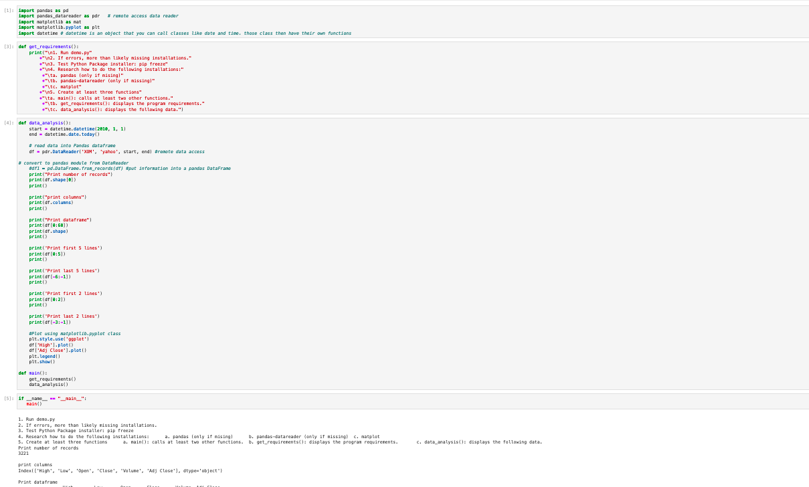
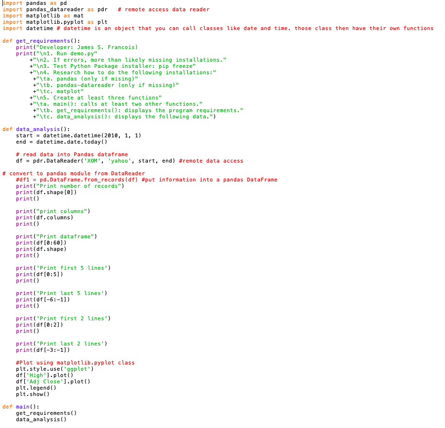
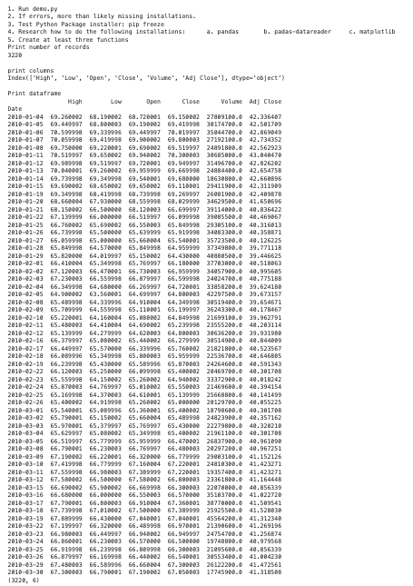
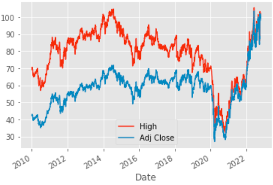
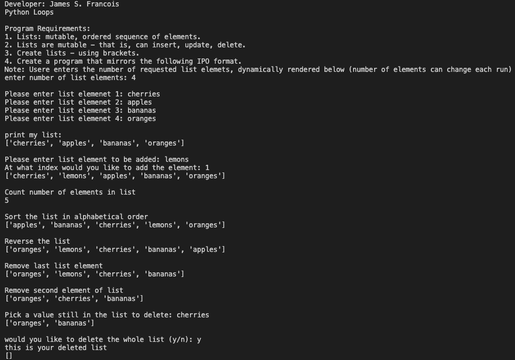
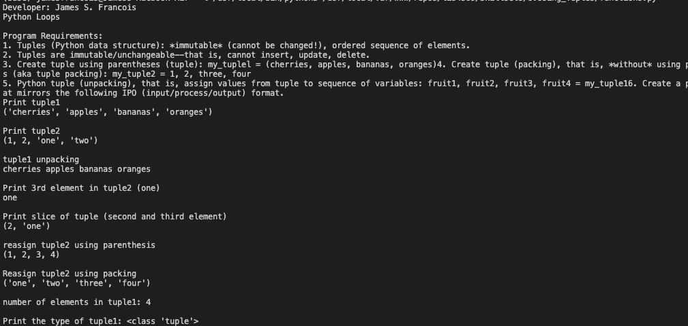
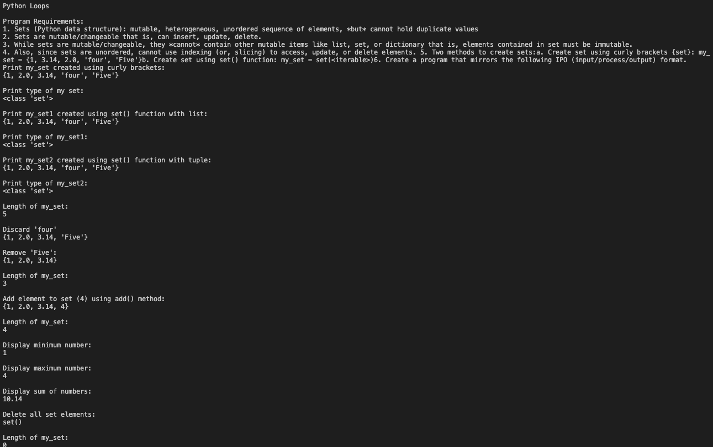

# LIS 4369 

## James Francois

### Project 1 Requirements:

1. Course title, your name, assignment requirements, as per A1; 
2. Screenshot of running applications first user interface; 
3. Screenshot of running applications second user interface;
4. Screenshots of Skillsets 

#### README.md file should include the following items:

* Course title, your name, assignment requirements, as per A1; 
* Screenshot of running applications first user interface; 
* Screenshot of running applications second user interface;
* Screenshots of Skillsets 

#### Assignment Screenshots:

| Screenshot of Juypter Labs | Screenshot of IDLE |
| -------------- | -------------- |
|  |  |

| Screenshot of Data Analysis | Screenshot of The Graph |
| -------------- | -------------- |
|  |  |

| Screenshot of Skillset 7 | Screenshot of Skillset 8 |
| -------------- | -------------- |
|  |  |

| Screenshot of Skillset 9 | 
| -------------- | 
|  | 
