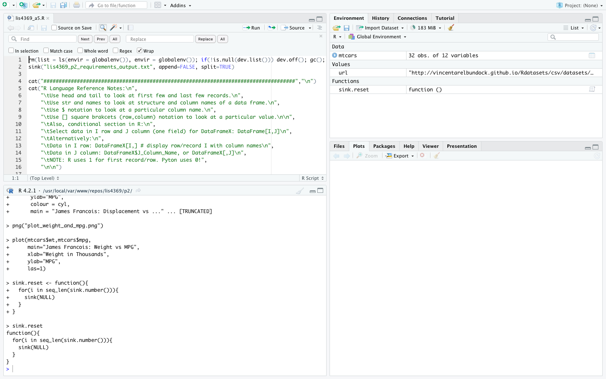
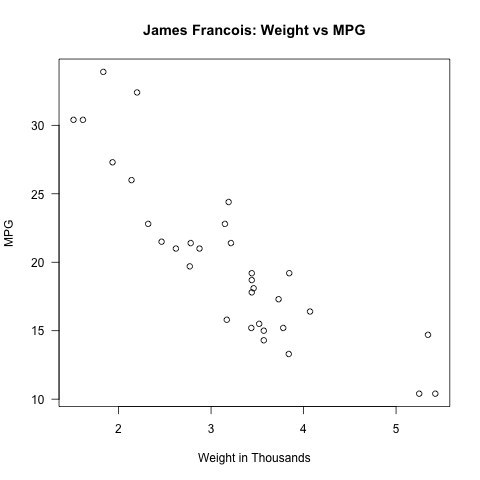
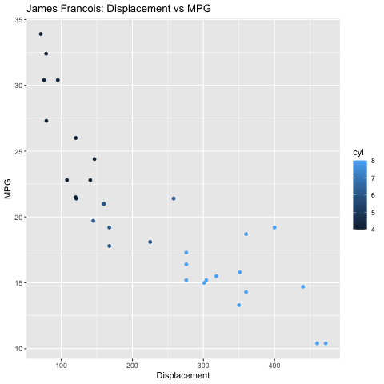

# LIS 4381 

## James Francois

### Project 2 Requirements:

*Sub-Heading:*

1. Assignment requirements, as per A1.
2. Save as lis4369_p2.R. Include link to file in p2 README.md file. 
3. Include link to lis4369_p2_output.txt file 
4. Include at least one 4-panel RStudio screenshot executing lis4369_p2.R code. 
5. Also, be sure to include at least two plots (*must* include *your* name in plot titles), in 
your README.md file. See examples below. 

#### README.md file should include the following items:

* Assignment requirements, as per A1.
* Save as lis4369_p2.R. Include link to file in p2 README.md file. 
* Include link to lis4369_p2_output.txt file 
* Include at least one 4-panel RStudio screenshot executing lis4369_p2.R code. 
* Also, be sure to include at least two plots (*must* include *your* name in plot titles), in 
your README.md file. See examples below. 

#### Assignment Screenshots:

*Screenshot of the 4 panels 

*Screenshot of first Graph

*Screenshot of the second Graph 

